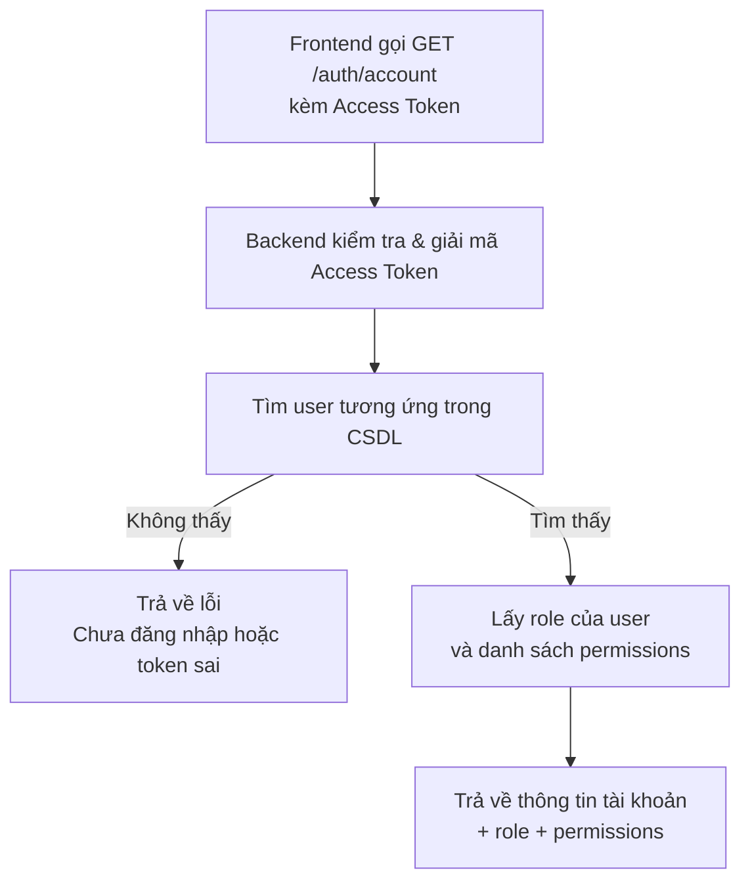
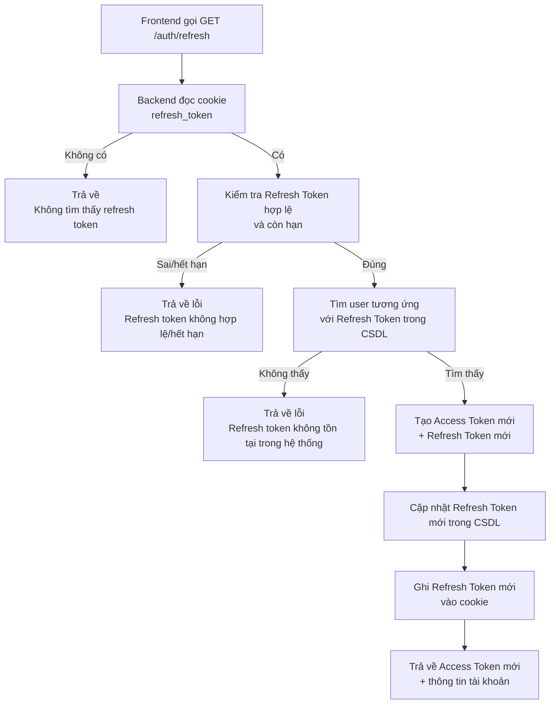
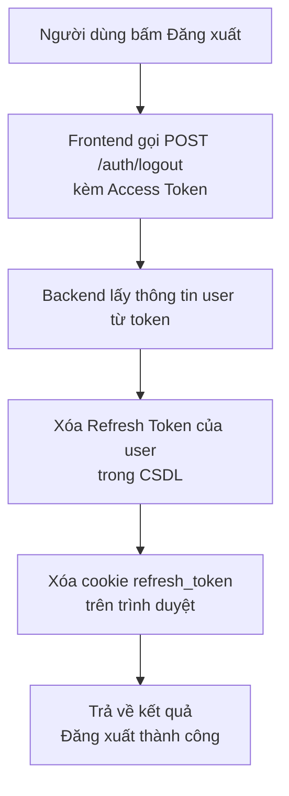

## Tài liệu bàn giao flow Auth (dành cho người không chuyên IT)

### 1. Các khái niệm đơn giản

- **Tài khoản (User)**: Gồm tên, email, mật khẩu (mật khẩu đã được mã hóa, không lưu dạng rõ).
- **Vai trò (Role)**: Nhóm quyền lớn, ví dụ: admin, nhân viên kho, kế toán...
- **Quyền chi tiết (Permission)**: Quyền tới từng chức năng nhỏ, gắn với một “đường dẫn API” và “phương thức” (GET, POST, PATCH, DELETE). Ví dụ: được phép tạo user, được phép xem danh sách phiếu nhập…
- **Access Token**: Thẻ ra vào tạm thời, được gửi kèm mỗi lần gọi API để chứng minh “tôi đang đăng nhập”.
- **Refresh Token**: Chìa khóa dự phòng để xin cấp lại Access Token mới khi gần hết hạn. Refresh Token được:
  - Lưu trong **cookie** của trình duyệt (tên `refresh_token`).
  - Lưu trong **CSDL** (trường `refreshToken` của user).

### 2. Flow đăng nhập (Signin)

**Mục tiêu**: Kiểm tra email/mật khẩu, nếu đúng thì cấp Access Token + Refresh Token và trả về thông tin tài khoản + quyền.

**API chính**: `POST /auth/signin`

**Diễn giải bằng lời**:
1. Người dùng mở màn hình đăng nhập, nhập **email** và **mật khẩu**.
2. Hệ thống kiểm tra email có tồn tại không và mật khẩu có đúng không.
3. Nếu sai, trả về thông báo “Email hoặc mật khẩu không đúng”.
4. Nếu đúng:
   - Hệ thống tạo **Access Token** (thẻ ra vào tạm thời).
   - Hệ thống tạo **Refresh Token** (chìa khóa dự phòng).
   - Lưu **Refresh Token** vào CSDL cho user đó.
   - Ghi **Refresh Token** vào cookie của trình duyệt (`refresh_token`, chỉ backend đọc được).
   - Trả về cho frontend:
     - Access Token.
     - Thông tin user (id, tên, email, role, danh sách permissions).

**Sơ đồ mermaid (flow đăng nhập)**:

```mermaid
flowchart TD
  A[Người dùng nhập email & mật khẩu<br \>trên màn hình đăng nhập] --> B[Backend nhận request<br \>POST /auth/signin]
  B --> C[Kiểm tra email tồn tại<br \>và chưa bị xóa]
  C -->|Không tồn tại| E[Trả về lỗi<br \>Email hoặc mật khẩu không đúng]
  C -->|Tồn tại| D[So sánh mật khẩu nhập<br \>với mật khẩu đã mã hóa trong CSDL]
  D -->|Sai| E[Trả về lỗi<br \>Email hoặc mật khẩu không đúng]
  D -->|Đúng| F[Tạo Access Token & Refresh Token]
  F --> G[Lưu Refresh Token vào CSDL<br \>của user]
  G --> H[Ghi Refresh Token vào cookie<br \>refresh_token (httpOnly, secure)]
  H --> I[Trả về Access Token<br \>+ thông tin user + quyền]
```

### 3. Flow lấy thông tin tài khoản đang đăng nhập

**Mục tiêu**: Cho frontend biết “tôi là ai”, đang có role gì, có những permission nào.

**API chính**: `GET /auth/account`

**Diễn giải**:
1. Frontend gửi request kèm **Access Token** trong header.
2. Hệ thống giải mã Access Token, tìm user trong CSDL.
3. Hệ thống lấy role của user và danh sách permission gắn với role đó.
4. Hệ thống trả về:
   - Thông tin cơ bản: id, tên, email.
   - Role: ví dụ `{ _id: '...', name: 'admin' }`.
   - Danh sách permissions (mỗi permission gắn với 1 API + method).



### 4. Flow làm mới Access Token (Refresh Token)

**Mục tiêu**: Khi Access Token sắp hết hạn/hết hạn, dùng Refresh Token (trong cookie) để xin Access Token mới mà không cần nhập lại mật khẩu.

**API chính**: `GET /auth/refresh`

**Diễn giải**:
1. Frontend gọi `GET /auth/refresh`, trình duyệt tự gửi kèm cookie `refresh_token`.
2. Backend đọc cookie:
   - Nếu không có `refresh_token` → báo “Không tìm thấy refresh token”.
3. Nếu có:
   - Kiểm tra Refresh Token có hợp lệ, còn hạn không.
   - Tìm trong CSDL user đang lưu Refresh Token này.
   - Nếu token sai, hết hạn, hoặc không còn trong CSDL → báo lỗi tương ứng.
4. Nếu hợp lệ:
   - Tạo **Access Token mới**.
   - Tạo **Refresh Token mới**.
   - Cập nhật Refresh Token mới trong CSDL.
   - Ghi lại Refresh Token mới vào cookie.
   - Trả về Access Token mới + thông tin tài khoản.



### 5. Flow đăng xuất (Signout / Logout)

**Mục tiêu**: Khi người dùng bấm “Đăng xuất”, hệ thống xóa Refresh Token để người đó không thể tiếp tục dùng phiên đăng nhập cũ.

**API chính**: `POST /auth/logout`

**Diễn giải**:
1. Frontend gửi request `POST /auth/logout`, kèm Access Token (vì chỉ người đang đăng nhập mới logout được).
2. Backend lấy thông tin user hiện tại từ token.
3. Hệ thống gọi logic:
   - Xóa Refresh Token trong CSDL cho user đó (gán `null`).
   - Xóa cookie `refresh_token` trên trình duyệt.
4. Sau bước này:
   - Access Token cũ sẽ hết hạn sau một thời gian ngắn.
   - Vì Refresh Token đã bị xóa, user **không thể xin token mới** → buộc phải đăng nhập lại.



### 6. Flow tạo tài khoản mới (Create User)

**Mục tiêu**: Admin hoặc người có quyền tạo tài khoản mới cho nhân viên.

**API chính**: `POST /users`

**Diễn giải**:
1. Người có quyền (ví dụ admin) đang đăng nhập, mở màn hình tạo user.
2. Nhập thông tin: tên, email, mật khẩu tạm, role, trạng thái kích hoạt…
3. Backend kiểm tra:
   - Email đã tồn tại trong hệ thống hay chưa.
   - Nếu đã tồn tại → báo lỗi.
4. Nếu hợp lệ:
   - Hệ thống **mã hóa mật khẩu** (không lưu mật khẩu gốc).
   - Tạo 1 bản ghi user mới trong CSDL:
     - name, email, password đã mã hóa, role, isActive, createdBy…
5. Trả về thông tin user mới (không bao gồm mật khẩu).

```mermaid
flowchart TD
  A[Admin mở màn hình<br \>Tạo tài khoản mới] --> B[Nhập tên, email,<br \>mật khẩu, role...]
  B --> C[Frontend gọi POST /users<br \>kèm Access Token]
  C --> D[Backend kiểm tra email<br \>đã tồn tại hay chưa]
  D -->|Đã tồn tại| E[Trả về lỗi<br \>Email đã tồn tại]
  D -->|Chưa tồn tại| F[Mã hóa mật khẩu]
  F --> G[Tạo user mới trong CSDL<br \>lưu kèm role & trạng thái]
  G --> H[Trả về thông tin user mới<br \>(ẩn mật khẩu)]
```

### 7. Flow kiểm tra role & phân quyền (Role + Permission)

**Mục tiêu**: Đảm bảo mỗi người chỉ được truy cập đúng chức năng được phép; riêng **role admin** có quyền làm mọi thứ.

**Cơ chế tổng quát**:
1. Mỗi user có:
   - Một **role** (ví dụ: admin, staff...).
   - Một danh sách **permissions** lấy từ role đó (mỗi permission gắn với 1 API + phương thức).
2. Khi gọi một API (ví dụ `GET /users`):
   - Hệ thống luôn kiểm tra Access Token (trừ khi API đó được đánh dấu là public, như `signin` hoặc `refresh`).
   - Sau khi biết user là ai, hệ thống:
     - Nếu role của user là **admin** → **cho phép tất cả**.
     - Nếu không phải admin:
       - Lấy đường dẫn API thực tế + phương thức (GET/POST/...).
       - So sánh với danh sách permissions của user.
       - Nếu có permission tương ứng → cho phép.
       - Nếu không có → chặn và trả về “Bạn không có quyền truy cập endpoint này”.

```mermaid
flowchart TD
  A[Frontend gọi 1 API bất kỳ<br \>kèm Access Token] --> B[Backend kiểm tra token<br \>(có hợp lệ không)]
  B -->|Token sai/hết hạn| C[Trả về lỗi<br \>Chưa đăng nhập hoặc token sai]
  B -->|Token đúng| D[Lấy thông tin user<br \>(role + permissions)]
  D --> E[API này có đánh dấu public?]
  E -->|Có| F[Cho phép truy cập<br \>(không cần kiểm tra quyền)]
  E -->|Không| G[Role của user có phải admin?]
  G -->|Admin| H[Cho phép truy cập<br \>mọi chức năng]
  G -->|Không phải admin| I[So sánh API hiện tại<br \>với danh sách permissions của user]
  I -->|Có permission khớp| J[Cho phép truy cập]
  I -->|Không có permission| K[Trả về lỗi<br \>Không có quyền truy cập]
```

### 8. Flow “force logout” (buộc user đăng xuất)

**Khái niệm**: “Force logout” là hành động buộc một tài khoản đang đăng nhập phải thoát ra, không tiếp tục sử dụng hệ thống được nữa nếu không đăng nhập lại.

**Cách hệ thống đang hỗ trợ về mặt kỹ thuật**:
- Khi user **tự đăng xuất**:
  - Refresh Token trong CSDL bị xóa.
  - Cookie `refresh_token` bị xóa.
  - Sau khi Access Token cũ hết hạn, user **bị buộc đăng nhập lại** → đây là dạng “force logout” tự nguyện.
- Khi quản trị muốn “buộc” một user ra khỏi hệ thống, có thể:
  - **Xóa Refresh Token** của user đó trong CSDL (giống hành vi logout phía backend).
  - Hoặc **soft-delete user** / khóa user:
    - Khi đã bị xóa mềm (`isDeleted = true`), các truy vấn user đều bỏ qua user này.
    - Token mới sẽ không được cấp nữa cho user đó.

**Ý nghĩa thực tế**:
- Sau khi Refresh Token của user bị xóa hoặc tài khoản bị vô hiệu hóa:
  - Các phiên đăng nhập hiện tại chỉ sống được tới khi **Access Token** hết hạn.
  - Sau đó user **không thể làm mới token**, không thể tiếp tục gọi API.
  - User muốn dùng lại hệ thống buộc phải liên hệ quản trị để được mở lại tài khoản hoặc cấp quyền đăng nhập mới.

```mermaid
flowchart TD
  A[Quản trị muốn buộc<br \>user A đăng xuất] --> B[Thao tác trên hệ thống<br \>(xóa Refresh Token hoặc khóa user)]
  B --> C[Refresh Token của user A<br \>không còn hợp lệ trong CSDL]
  C --> D[User A vẫn dùng Access Token cũ<br \>cho tới khi hết hạn]
  D --> E[Khi Access Token hết hạn,<br \>frontend gọi /auth/refresh]
  E --> F[Backend kiểm tra Refresh Token<br \>không còn trong CSDL hoặc sai]
  F --> G[Trả về lỗi<br \>Không làm mới được token]
  G --> H[User A buộc phải<br \>đăng nhập lại nếu muốn tiếp tục]
```

---

### 9. Tóm tắt nhanh cho người vận hành

- **Đăng nhập**: Dùng `POST /auth/signin`, nếu thành công hệ thống trả Access Token + lưu Refresh Token vào cookie và CSDL.
- **Xem tài khoản hiện tại**: Dùng `GET /auth/account`, cần Access Token hợp lệ.
- **Làm mới phiên đăng nhập**: Dùng `GET /auth/refresh`, đọc Refresh Token từ cookie để cấp Access Token mới.
- **Đăng xuất**: Dùng `POST /auth/logout`, xóa Refresh Token trong CSDL và cookie, phiên đăng nhập sẽ hết hiệu lực.
- **Tạo tài khoản mới**: Dùng `POST /users`, mật khẩu luôn được mã hóa trước khi lưu.
- **Phân quyền**: Dựa trên Role + Permission, admin làm được tất cả, các role khác chỉ được phép theo danh sách permissions được gán.
- **Force logout**: Xóa Refresh Token trong CSDL hoặc vô hiệu hóa tài khoản → sau khi token hiện tại hết hạn, user buộc phải đăng nhập lại.

