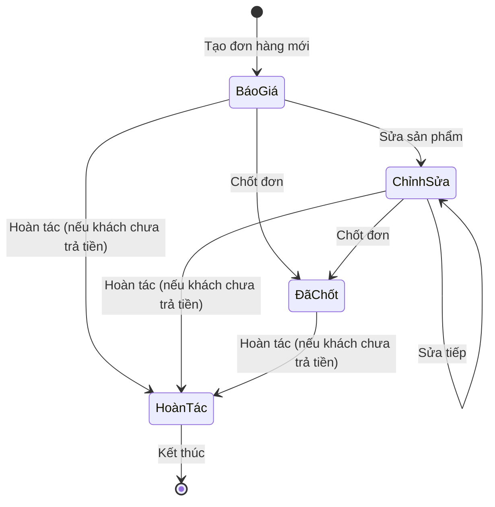
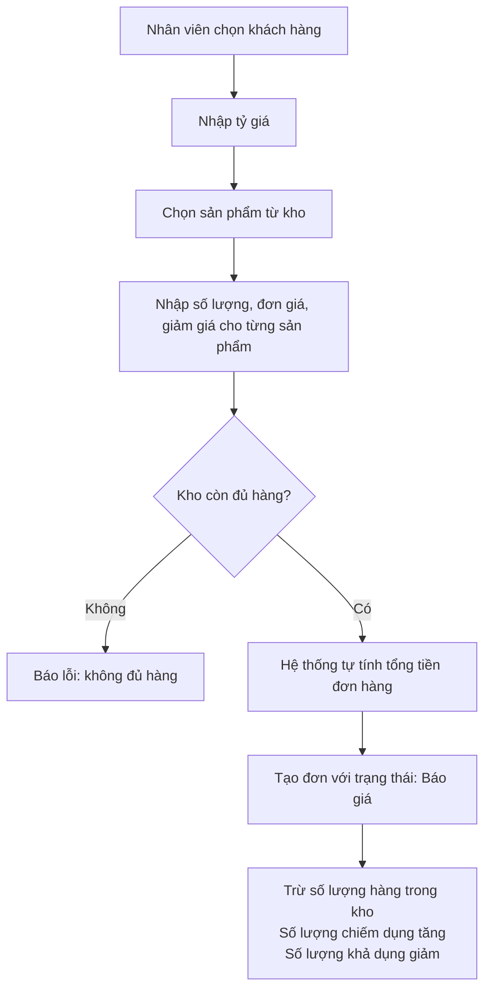
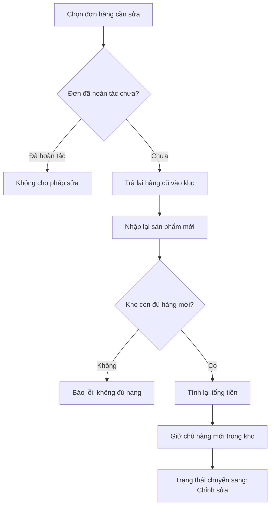
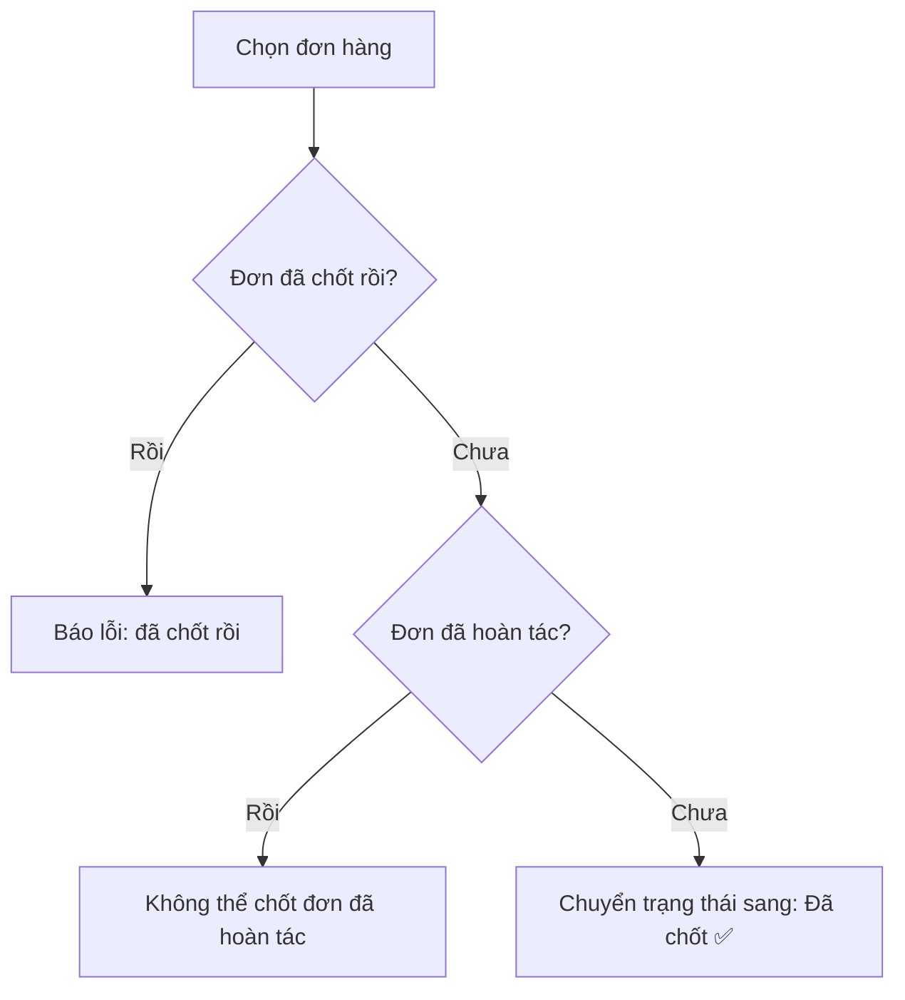
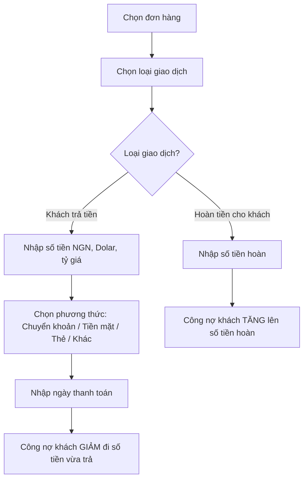
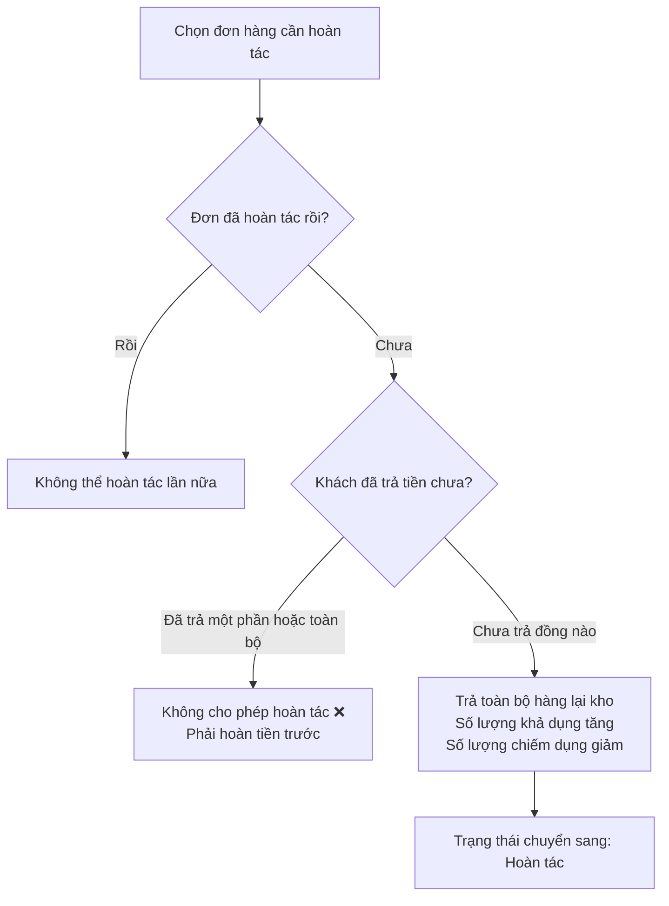
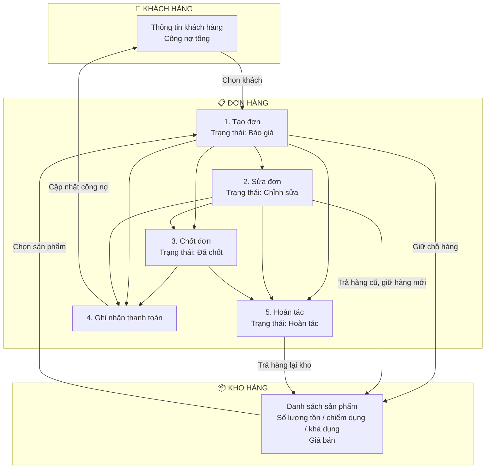
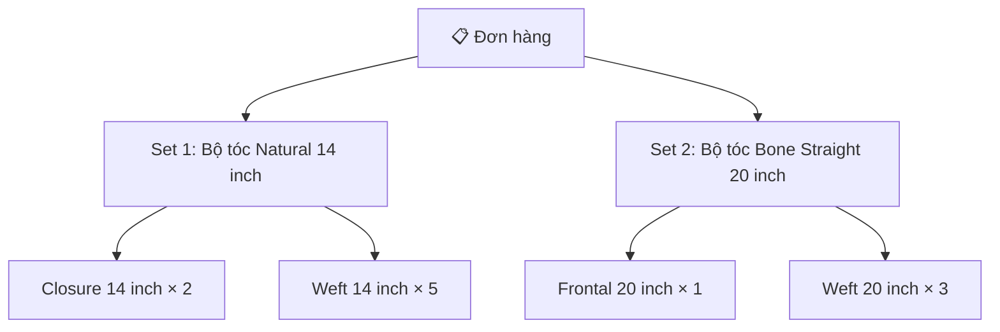

# Quy Trình Quản Lý Đơn Hàng Khách Hàng

## 1. Tổng Quan

Hệ thống quản lý đơn hàng gồm 3 phần chính:

| Phần | Mô tả |
|------|--------|
| **Khách hàng** | Thông tin khách mua hàng, theo dõi công nợ |
| **Kho hàng** | Quản lý số lượng tồn kho, giá bán của từng mặt hàng |
| **Đơn hàng** | Ghi nhận giao dịch mua bán giữa khách hàng và kho |

---

## 2. Vòng Đời Đơn Hàng (Trạng Thái)

Mỗi đơn hàng sẽ đi qua các trạng thái sau:

| Trạng thái | Ý nghĩa |
|------------|----------|
| **Báo giá** | Đơn hàng vừa được tạo, đang ở giai đoạn báo giá cho khách |
| **Chỉnh sửa** | Đơn hàng đang được chỉnh sửa lại sản phẩm hoặc số lượng |
| **Đã chốt** | Khách đồng ý, đơn hàng được xác nhận chính thức |
| **Hoàn tác** | Hủy đơn hàng, trả lại hàng vào kho |

### Sơ đồ chuyển trạng thái

---

## 3. Quy Trình Chi Tiết Từng Bước

### Bước 1: Tạo đơn hàng mới

**Giải thích đơn giản:**
- Khi tạo đơn, hàng trong kho sẽ bị **"giữ chỗ"** (chiếm dụng) cho đơn hàng này.
- Tổng tiền đơn hàng được tính tự động dựa trên: `Số lượng × Đơn giá − Giảm giá`.
- Ban đầu khách chưa trả tiền nên hệ thống ghi nhận khách **nợ toàn bộ** giá trị đơn hàng.

---

### Bước 2: Chỉnh sửa đơn hàng (nếu cần)

**Giải thích đơn giản:**
- Khi sửa đơn, hệ thống sẽ **trả hàng cũ lại kho** trước, rồi mới **giữ hàng mới**.
- Tổng tiền và công nợ được tính lại dựa trên sản phẩm mới.

---

### Bước 3: Chốt đơn hàng

**Giải thích đơn giản:**
- Chốt đơn nghĩa là **xác nhận chính thức** đơn hàng này.
- Chỉ chốt được khi đơn chưa chốt và chưa hoàn tác.

---

### Bước 4: Ghi nhận thanh toán (Lịch sử thanh toán)

Sau khi đơn hàng được tạo, khách có thể thanh toán nhiều lần. Mỗi lần thanh toán sẽ được ghi vào lịch sử.

**Giải thích đơn giản:**

| Loại giao dịch | Ý nghĩa | Ảnh hưởng công nợ |
|----------------|----------|-------------------|
| **Khách trả** | Khách thanh toán tiền hàng | Nợ **giảm** (khách nợ ít hơn) |
| **Hoàn tiền** | Cửa hàng trả lại tiền cho khách | Nợ **tăng** (khách nợ nhiều hơn) |

> **Về đơn vị tiền:** Hệ thống hỗ trợ 2 đơn vị tiền: **NGN** (Naira) và **Dolar (USD)**. Tỷ giá quy đổi được nhập khi tạo đơn hàng và khi ghi nhận thanh toán.

---

### Bước 5: Hoàn tác đơn hàng (Hủy đơn)

**Giải thích đơn giản:**
- Hoàn tác = **hủy đơn hàng** và **trả hàng lại kho**.
- Chỉ được hoàn tác khi khách **chưa trả bất kỳ đồng nào** (tức công nợ đúng bằng tổng giá trị đơn hàng).

---

## 4. Sơ Đồ Tổng Quan Toàn Bộ Quy Trình

---

## 5. Quản Lý Kho Hàng — Cách Số Lượng Thay Đổi

| Hành động | Số lượng chiếm dụng | Số lượng khả dụng |
|-----------|---------------------|-------------------|
| Tạo đơn hàng | **Tăng** (hàng bị giữ) | **Giảm** (hàng còn ít hơn) |
| Sửa đơn hàng | Trả cũ rồi giữ mới | Cập nhật lại theo sản phẩm mới |
| Hoàn tác đơn hàng | **Giảm** (hàng được trả lại) | **Tăng** (hàng có thêm) |

> **Tổng số lượng** = Số lượng chiếm dụng + Số lượng khả dụng (luôn không đổi)

---

## 6. Công Nợ Khách Hàng — Cách Tính

| Giá trị | Ý nghĩa |
|---------|----------|
| **Số âm (−)** | Khách đang **nợ** tiền |
| **Số dương (+)** | Khách đã trả **thừa** tiền |
| **Bằng 0** | Khách đã thanh toán đủ |

**Ví dụ minh họa:**

1. Tạo đơn hàng 1.000 NGN → Công nợ: **−1.000** (khách nợ 1.000)
2. Khách trả 600 NGN → Công nợ: **−400** (khách còn nợ 400)
3. Khách trả tiếp 500 NGN → Công nợ: **+100** (khách trả thừa 100)

---

## 7. Phân Quyền

| Chức năng | Ai được làm? |
|-----------|-------------|
| Tạo khách hàng | Tất cả nhân viên |
| Xóa khách hàng | Chỉ **Admin** |
| Tạo đơn hàng | Tất cả nhân viên |
| Sửa đơn hàng | Tất cả nhân viên |
| Chốt đơn hàng | Tất cả nhân viên |
| Hoàn tác đơn hàng | Tất cả nhân viên |
| Ghi nhận thanh toán | Tất cả nhân viên |
| Xóa đơn hàng | Chỉ **Admin** |
| Thêm sản phẩm vào kho | Tất cả nhân viên |

---

## 8. Phương Thức Thanh Toán Được Hỗ Trợ

| Phương thức | Mô tả |
|------------|-------|
| Chuyển khoản | Thanh toán qua tài khoản ngân hàng |
| Tiền mặt | Thanh toán trực tiếp bằng tiền mặt |
| Thẻ | Thanh toán bằng thẻ (Visa, MasterCard...) |
| Khác | Các hình thức thanh toán khác |

---

## 9. Cấu Trúc Sản Phẩm Trong Đơn Hàng

Mỗi đơn hàng có thể chứa nhiều **nhóm sản phẩm (Set)**. Mỗi nhóm gồm nhiều **mặt hàng** lấy từ kho.

**Hai cách tính giá:**

| Cách tính | Khi nào dùng? | Công thức |
|-----------|--------------|-----------|
| **Tính theo từng mặt hàng** | Khi không bật "Tính theo Set" | Số lượng × Đơn giá − Giảm giá (cho từng mặt hàng) |
| **Tính theo Set** | Khi bật "Tính theo Set" | Số lượng Set × Giá Set − Giảm giá Set |

---

## 10. Lưu Ý Quan Trọng

- Hệ thống **không xóa dữ liệu thật sự**, chỉ đánh dấu "đã xóa" để có thể khôi phục khi cần.
- Mọi thay đổi đều ghi nhận **ai làm** và **khi nào** (thời gian tạo, thời gian cập nhật).
- Tỷ giá có thể khác nhau giữa các đơn hàng và giữa các lần thanh toán.
